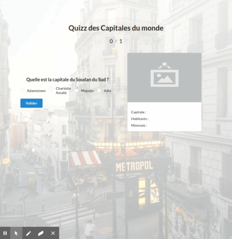

# CapitalQuizz



### Création d'un quizz sur les capitales du monde, 


* Affichage d'un message si bonne ou mauvaise réponse

* Affichage d'un composant Card avec quelques informations sur le pays en question ( Capitale, Habitants, Monnaie ...) suite à une réponse

* Utilisation de JQuery, Ajax

* Utilisation du Framework CSS [Semantic-UI](https://semantic-ui.com/)

* Utilisation d'une API publique (pour les requêtes AJax) accessible à l'adresse [https://restcountries.eu/rest/v2/all](https://restcountries.eu/rest/v2/all), qui renvoit un fichier json contenant avec un tableau d'objets de cette forme (exemple pour le pays "FRANCE") :

```Json
{
name: "France",
topLevelDomain: [
".fr"
],
alpha2Code: "FR",
alpha3Code: "FRA",
callingCodes: [
"33"
],
capital: "Paris",
altSpellings: [
"FR",
"French Republic",
"République française"
],
region: "Europe",
subregion: "Western Europe",
population: 66710000,
latlng: [
46,
2
],
demonym: "French",
area: 640679,
gini: 32.7,
timezones: [
"UTC-10:00",
"UTC-09:30",
"UTC-09:00",
"UTC-08:00",
"UTC-04:00",
"UTC-03:00",
"UTC+01:00",
"UTC+03:00",
"UTC+04:00",
"UTC+05:00",
"UTC+11:00",
"UTC+12:00"
],
borders: [
"AND",
"BEL",
"DEU",
"ITA",
"LUX",
"MCO",
"ESP",
"CHE"
],
nativeName: "France",
numericCode: "250",
currencies: [
{
code: "EUR",
name: "Euro",
symbol: "€"
}
],
languages: [
{
iso639_1: "fr",
iso639_2: "fra",
name: "French",
nativeName: "français"
}
],
translations: {
de: "Frankreich",
es: "Francia",
fr: "France",
ja: "フランス",
it: "Francia",
br: "França",
pt: "França",
nl: "Frankrijk",
hr: "Francuska",
fa: "فرانسه"
},
flag: "https://restcountries.eu/data/fra.svg",
regionalBlocs: [
{
acronym: "EU",
name: "European Union",
otherAcronyms: [ ],
otherNames: [ ]
}
],
cioc: "FRA"
},
```

---

Je me suis donc servi de cette API pour mes algorithmes de comparaison entre la réponse renvoyée par l'utilisateur et la vraie réponse présente dans le fichier Json, ainsi que la génération des informations du composant Card.

J'ai également du mettre en place un système de ramdom selection pour que les mauvaises réponses proposées pour chaque question ne soient pas toujours les mêmes et dans le meme ordre d'affichage. 


